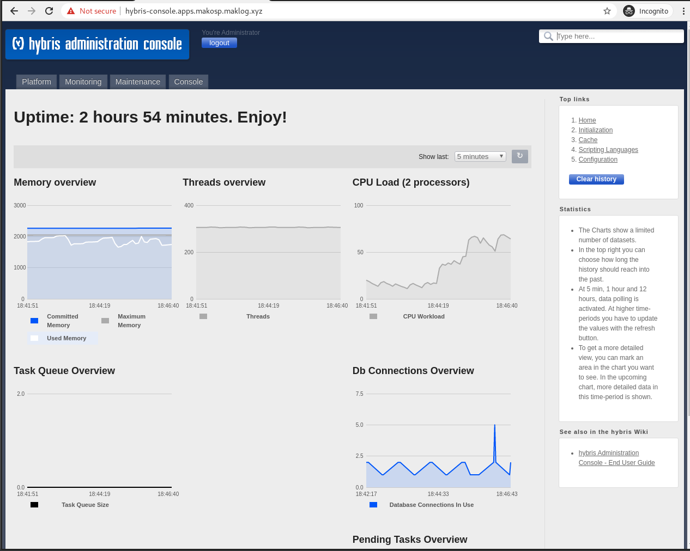
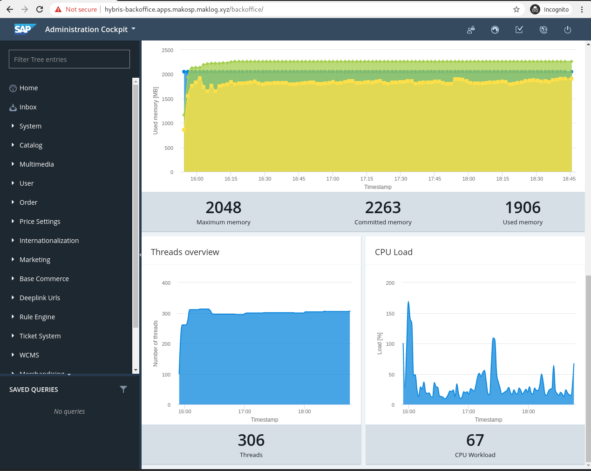

# Deploy SAP Commerce in OpenShift Container Platform

This repository was used as the source for the Blog Post 'Building and running SAP Commerce in OpenShift'.

Follow the instructions to Build and Deploy SAP Commerce into your OpenShift Platform

## Repository content

- Dockerfile: this file contains the specifications to create a SAP Commerce base image to be used later to deploy applications into the SAP Commerce platform
- s2i: this directory contains the required files to build and run the final application using Source to Image approach
- templates/hybris-base.yml: this template describes the objects to be created in OpenShift in order to build the SAP Commerce base image and make it available for specific SAP Commerce application builds
- templates/hybris-app.yml: this template describes the objects to be created in OpenShift in order to build and deploy a specific SAP Commerce application using the SAP Commerce container base image
- supporting-tools: directory that contains different objects used during the process validation to support the blog post demonstration

## How to build and deploy the app

The first thing we are going to do is to create an empty project in our OpenShift cluster. This can be done using the OpenShift Console or the OpenShift CLI:

```bash
oc new-project sap-commerce --display-name='SAP Commerce' --description='SAP Commerce'
```

Both base image build process and final application build process expect some objects and tools to be present in order to work. The base image and the final application image are built from source code. While instanciating the templates, this information must be passed as part of the parameters. For this use case, Nexus and Gogs were deployed into the Cluster but any existing Artifact Repository and Source Code Management tool can be used for this. If you want to use the examples from the supporting tools directory you can deploy those:

```bash
oc process -f supporting-tools/gogs.yml | oc create -f-
oc process -f supporting-tools/nexus.yml | oc create -f-
```

Please check that both templates can accept parameters if you want to change the default ones used for this procedure

The deployed OpenShift objects will expect some Secrets and ConfigMaps to be in place. These are not included as part of the templates as this is very opinionated to your own Infrastructure. As an example these are the ones used during this procedure in case you want to used those. Please notice that the required information to be injected is not valid as-is so this need to be ammended before applying the objects to match your requirements:

```bash
oc process -f supporting-tools/gogs-secret.yml | oc create -f-
oc process -f supporting-tools/hybrisconfig.yml | oc create -f-
oc process -f supporting-tools/hybrislicense.yml | oc create -f-
oc process -f supporting-tools/nexus-secret.yml | oc create -f-
```

For this procedure we used this GitHub repository as the Source Repository for the SAP Commerce base image. The recommendation is to fork this repo or even clone and push it to your own SCM so you can reference it when instanciating the template.

Once we have created the Project where we are building and deploying SAP Commerce we can instantiate the templates:

```bash
oc process -f templates/hybris-base.yml -p SOURCE_REPOSITORY_URL=https://github.com/redhat-sap/sap-commerce.git | oc create -f-
oc process -f templates/hybris-app.yml -p SOURCE_REPOSITORY_URL=<my private repo for the app> | oc create -f-
```

The `SOURCE_REPOSITORY_URL` parameter is the only one that has not a predefined value, but please review both templates as more parameters can be used to adapt the object to your environment requirements.

As part of the template instanciation many objects will be created as you can see from the command output:

```bash
imagestream.image.openshift.io/ubi created
imagestream.image.openshift.io/hybris-base created
buildconfig.build.openshift.io/hybris-base created

imagestream.image.openshift.io/hybris-app created
service/hybris-app created
route.route.openshift.io/hybris-app created
buildconfig.build.openshift.io/hybris-app created
deploymentconfig.apps.openshift.io/hybris-app created
```

All of them are important and need to be created so the application is built, deployed and finally becomes accesible, but we are going to focus in 2 of the objects here so this are explained further:

- The `hybris-base` BuildConfig -- this is the object that OpenShift will use to build the SAP Commerce container base image. The build strategy is `dockerStrategy` which means it will read the instructions from your container manifest file and create the container image follow those instructions. If you check the instructions from the Dockerfile you will see that a specific directory called `s2i` is injected in the container image. This will add the Source to Image capability and specific instructions to the base image that we are going to use next to build the final application using this `s2i` strategy.

- The `hybris-app` BuildConfig -- this is the object that OpenShift will use to build the final application to be deployed in the SAP Commerce platform from the previuos generated base image. As mentioned before, this will ise Source to Image strategy, which means it will pull the content of your Source Repository for your application and build the application ussing the s2i/assemble instructions and the resultant container image will have the entrypoint instructions from s2i/run file.

If everything goes fine, once the 2 build jobs have finalized, a new deployment will be rollout driven by the `hybris-app` DeploymentConfig, and SAP Commerce platormf will be accessible through the corresponing already created Route.




